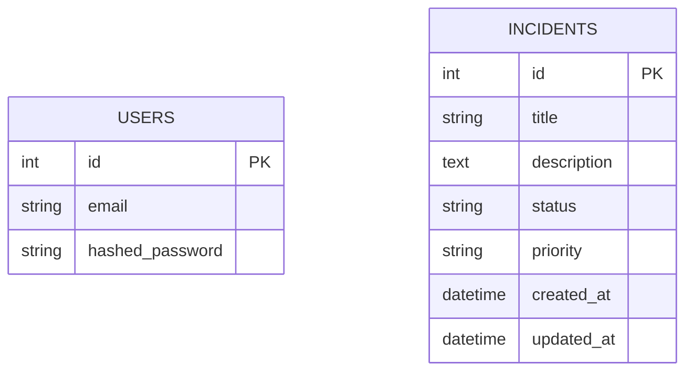

# System Design & Database Theory: Lite-Dispatch

This document analyzes the engineering decisions behind `Lite-Dispatch`.

## 1. High-Level Architecture
We followed a **Layered Architecture** (Separation of Concerns).

```mermaid
graph TD
    Client[Client / Client] -->|HTTP Request| API[API Layer (main.py)]
    API -->|Pydantic Models| Service[Service Layer (service.py)]
    Service -->|SQLAlchemy Models| Data[Data Layer (models.py)]
    Service -.->|Events| Plugins[Plugin System]
    Data -->|SQL| DB[(PostgreSQL)]
```

### Key Components
1.  **API Layer (`main.py`)**: The "Controller". It handles HTTP (Status codes, Headers, Parsing JSON). It contains **Zero Business Logic**.
2.  **Service Layer (`service.py`)**: The "Brain". It handles the State Machine, Validation (`ValueError`), and orchestrates Plugins. It is unaware of HTTP.
3.  **Data Layer (`models.py`)**: The "State". Defines the shape of data in the DB.
4.  **Plugin System (`plugins/`)**: The "Extensions". logic that runs *mostly* as side-effects (Notifications).

---

## 2. Database Design (ER Diagram)

We implemented two primary entities: `User` and `Incident`.



### Analysis of fields
*   **Primary Keys (`id`)**: We used `Integer` (Serial). In ultra-high scale (Netflix scale), we might prefer UUIDs to prevent enumeration attacks and allow distributed generation.
*   **Constraints**:
    *   `User.email`: Has a **Unique Index** (`UK`) to ensure no duplicates.
*   **Defaults**:
    *   `Incident.status`: Defaults to "Open".
    *   `Incident.priority`: Defaults to "Low".
*   **Indexing**: We indexed `Incident.title` and `User.email` because these are common search fields.
*   **Enums vs Strings**: We stored `Status` as strings ("Open").
    *   *Pro*: Simple, easy to read in raw SQL.
    *   *Con*: Takes more space than an Integer ID. Renaming "Open" to "New" requires updating every row.

---

## 3. Database Concepts in Practice

### A. ACID Properties
How `Lite-Dispatch` ensures reliability:

1.  **Atomicity** ("All or Nothing")
    *   **In Code**: `db.commit()`.
    *   **Scenario**: If we create an Incident, but the database crashes while writing the creation timestamp, the *entire* row insertion is rolled back. You will never find a "half-written" incident.
    *   **Testing**: In `conftest.py`, we use `transaction.rollback()` to ensure tests are atomic and don't leak data.

2.  **Consistency** (Valid State)
    *   **DB Level**: The `UNIQUE` constraint on `User.email` guarantees you can't have two admins with the same email. The DB rejects the valid transaction if it violates this rule.
    *   **App Level**: Pydantic ensures `title` is always a string, never a number.

3.  **Isolation** (Concurrent Transactions)
    *   **PostgreSQL**: Handles this. If two users declare "Cloud is Down" at the exact same millisecond, Postgres puts them in a queue (Serialization). One insert happens, then the other. They don't overwrite each other's memory.

4.  **Durability** (Saved Forever)
    *   Once `db.commit()` returns successfully, the data is on the disk (Write-Ahead Log). Even if the Docker container crashes 1ms later, the data is safe.

### B. Normalization
Normalization reduces redundancy.

*   **1st Normal Form (1NF)**: Atomic Columns.
    *   We follow this. `description` contains just text, not a JSON list of comments (though Postgres *can* do JSON, strictly 1NF discourages it for core relational data).
    *   We don't have repeating groups (e.g., `tag1`, `tag2`, `tag3` columns).

*   **2nd Normal Form (2NF)**: No Partial Dependencies (applies to Composite Keys).
    *   Since we use a single Primary Key (`id`) for both tables, we are automatically 2NF.

*   **3rd Normal Form (3NF)**: Transitive Dependencies.
    *   *Current Design*: We store `priority` ("High") directly in the `Incidents` table.
    *   *Ideally*: If "High" priority implied a specific SLA (e.g., "Must resolve in 2 hours"), storing both "High" and "2 hours" in the `Incidents` table would violate 3NF.
    *   *Fix*: We would create a `Priorities` table (`id`, `name`, `sla_hours`) and link it via Foreign Key.
    *   *Decision*: For `Lite-Dispatch`, denormalizing (storing the string) is faster and simpler (KISS principle).

### C. The N+1 Problem (Why ORMs are tricky)
In `main.py`, `read_incidents` does:
`db.query(models.Incident).offset(skip).limit(limit).all()`

This is **efficient** (1 Query).

**The Trap**: If we added an `author` relationship:
```python
for incident in incidents:
    print(incident.author.name) # TRAP!
```
This would run **1 query for the list**, and then **1 query per incident** to get the author (N+1 queries).
*   **Fix**: `db.query(models.Incident).options(joinedload(models.Incident.author))` to fetch everything in 1 query.

## 4. System Design Patterns Used

1.  **Dependency Injection**: `Depends(get_db)` decouples the DB connection from the logic.
2.  **Repository/Service Pattern**: `service.py` acts as the repository of business rules.
3.  **Observer Pattern (ish)**: The Plugin system listens for the "Incident Created" event and reacts.
4.  **Asynchronous Background Jobs**: Using `BackgroundTasks` to decouple heavy I/O (Plugins) from the Request/Response cycle.

This architecture is "clean". It is testable, maintainable, and scalable up to a mid-sized engineering team.
